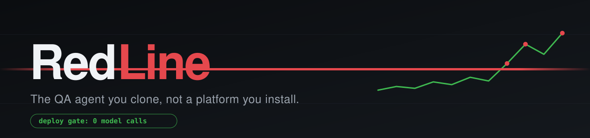
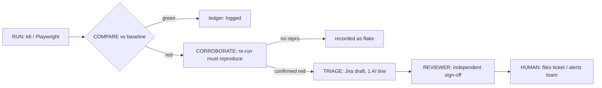

<div align="center">



**Describe what to test in plain language, and AI writes the k6 and Playwright scripts. A deterministic, model-free gate blocks the regressions.**

[](LICENSE)
[](https://nodejs.org)
[](tests/)
[](STATUS.md)
[](package.json)
[](https://k6.io)
[](https://playwright.dev)

</div>

---

## What is RedLine?

RedLine is a QA agent you `git clone`, not a platform you install. **Its AI subagents write the tests; its deterministic core runs them.** Tell it what to test in plain language and it authors the **k6 (performance)** or **Playwright (functional)** script, benchmarks it, and sets a **red/green baseline**, then **blocks any deploy that crosses the red line**. No Kubernetes, no operator, no server to maintain: it runs on a laptop or one CI runner, and the dashboard is a single zero-dependency Node file.

AI does the expensive thinking: authoring scripts, healing broken locators, narrating regressions. The things that must never be creative (the merge gate, the verdict, the ledger) **are plain deterministic code with exit codes**.

## Why RedLine?

- ✍️ **AI writes the tests, you don't.** Describe the API or user journey in plain language; the agent authors the k6 / Playwright script, verifies it against your live app in a self-healing fix loop, and presents the scope for your approval. No k6 or Playwright expertise required.
- ⚡ **Zero infrastructure.** `git clone` + `node dashboard/server.mjs`. No cluster, no database, no `npm install` for the dashboard. Results from CI in other repos can still merge into one view ([tools/README.md](tools/README.md)).
- 🚦 **AI authors, determinism gates.** The deploy gate ([`run-k6-action`](.github/actions/run-k6-action/)) makes **zero model calls**: run → compare to baseline → exit `0` (green) or `99` (red). Your CI never waits on or pays for an LLM.
- 🔁 **A red must reproduce before anyone is paged.** Every red is corroborated by a re-run; flakes are recorded, not escalated. Filing to Jira/Slack is always behind a human click.

## Quick start

**Prerequisites**

| Tool | Version | Used for |
|---|---|---|
| [Node.js](https://nodejs.org) | ≥ 20 | dashboard + all deterministic tooling |
| [k6](https://k6.io/docs/get-started/installation/) | ≥ 2.0 | performance suites |
| [Playwright](https://playwright.dev/docs/intro) | ≥ 1.54 | functional suites |
| [Claude Code](https://claude.com/claude-code) | latest | the agent that walks the tree (authoring, triage) |

Only the suite type you actually run needs its tool: the dashboard and `npm test` need neither k6 nor Playwright. Functional suites also need the browser binaries once, via `npx playwright install chromium`. If you install k6 while a terminal is already open, start a new one before launching the dashboard, or its environment check will still report k6 as missing.

```bash
git clone https://github.com/kvantatech/RedLine.git
cd RedLine
node dashboard/server.mjs        # → opens http://127.0.0.1:4242
```

Answer the wizard's plain-language questions (team name, the API or user journey you care about) and RedLine **creates the k6 test, runs a first 10-iteration benchmark, and sets your red line live in front of you**. You don't need to be a performance engineer. Details: [dashboard/README.md](dashboard/README.md).

Verify your copy in ten seconds (38 checks, no install):

```bash
npm test
```

## How it works



The same loop gates deploys: in enforce mode the composite Action exits `99` on a confirmed red and the merge/canary stops, **deterministically, with no model in the path**.

**The agent is a file tree, not a framework.** One general coding agent (Claude Code) walks it. No LangChain, no Agent SDK, no orchestration runtime:

- **9 workflows** (`.claude/workflows/`): fixed recipes that sequence skills
- **36 skills** (`.github/skills/`): one deterministic job each, narrow tool allowlists (+ 5 vendored k6 helper skills in `.claude/skills/`)
- **3 subagents** (`.github/agents/`): the *only* model calls: `reviewer` (anti-anchoring sign-off), `script-author` (k6 generation), `spec-author` (Playwright generation)

## Key concepts

| Concept | Meaning |
|---|---|
| **Team** | A folder of tests owned by one team. Drafts live in `workbench/<team>/`, proven suites graduate to `envs/<team>/` (read-only, write only via graduation). Ships with examples to copy: `demo-web`, `demo-api`, `quickpizza-team`, `saucedemo-team`, `redline-dashboard` (the built-in self-test). |
| **Baseline** | `baselines/<team>.<profile>.json`: the red/green p95 thresholds per test. Seeded from a real first benchmark, never guessed. |
| **Verdict** | **Green or red. Nothing else.** No ambers, no scores. A test either holds its line or it doesn't. |
| **The gate** | `run-k6-action`: deterministic composite Action; exit `0`/`99`/`97`. The one verdict implementation (`compare-core.js`) shared by CI and the agentic loop. |
| **Healing** | Proven suites that break from UI drift get locator/timing repairs **proposed as a diff**. A product bug is never masked. Per-team `ask`/`trust` policy. |
| **Ledger** | `state/run-ledger.jsonl`: append-only record of every run; the idempotency key that stops duplicate triage per deploy. |

## For AI agents 🤖

If you are an AI assistant setting up or operating this repo, your entry points are:

| File | What it gives you |
|---|---|
| [`CLAUDE.md`](CLAUDE.md) | System prompt: the hard rules (two verdicts, zero-model gate, human-gated filing), teams model, current state |
| [`AGENTS.md`](AGENTS.md) | The file-tree agent architecture and where judgment is allowed |
| [`.mcp.json`](.mcp.json) | MCP servers used per phase (k6, Playwright) |
| [`dashboard/mcp-server.mjs`](dashboard/README.md) | **RedLine as an MCP server**: list tests, run them, read runs/baselines/flakes from any MCP client (zero deps, stdio) |
| [`.claude/workflows/`](.claude/workflows/) | The recipes to follow: start with `perf-author` or `func-author` |

## Reference

<details>
<summary><b>Workflows (9)</b></summary>

**Performance core**
- `perf-author`: TYPE-GATE → EXPLORE → LEARN → AUTHOR → **SCOPE-REVIEW [HUMAN]** → VERIFY → DELIVER. Authors a new k6 script; ends at a draft PR.
- `perf-run-one`: RUN → COMPARE → TRIAGE → REVIEW → proof → CURATE. The operational loop; cron (trend) or per-deploy (gate) trigger.

**Functional core**
- `func-author`: explore live via Playwright MCP → `spec-author` generates → scope-review [HUMAN] → verify (≤3 rounds) → graduate.
- `func-run-one`: run → verdict → corroborate reds → **heal test rot** → triage → reviewer → Jira draft.

**Fleet (same skills, fanned out)**
- `perf-sweep`: teams × profiles × envs; one cost-capped cited report.
- `prod-stg-parity-check`: set-diff STG vs PROD; authors the missing scripts.
- `mass-onboarding`: fan `perf-author` across every team in one pass.
- `baseline-curate-all`: fan `curate-baselines`; draft baseline-bump PRs.
- `build-status`: regenerate the status view.

</details>

<details>
<summary><b>The file tree (how control flows)</b></summary>

```
WORKFLOWS  (.claude/workflows/<name>/)        ← deterministic recipes; the control-flow layer
│  perf-author · perf-run-one · perf-sweep · prod-stg-parity-check · mass-onboarding
│  baseline-curate-all · func-author · func-run-one · build-status
│
└── call SKILLS  (.github/skills/<name>/SKILL.md)   ← one job each; no judgment
        │  run-k6-script · parse-k6-json-summary · compare-to-baseline · triage-perf-verdict
        │  run-playwright-suite · parse-playwright-summary · func-verdict · heal-playwright-suite
        │  k6 profile skills (benchmark · load · stress · soak · spike) · + 20 more
        │
        │  Each skill: Prompt (exact instructions) · Tools (narrow MCP allowlist) · Data (files it touches)
        │
        └── (only when earned) SUBAGENTS  (.github/agents/)   ← the only 3 model loops
                │  reviewer · script-author · spec-author
                │
                └── use MCP TOOLS  (.mcp.json)   ← phase-of-need; never all at once
                        └── read / write DATA
                                baselines/<team>.<profile>.json  ← red/green thresholds
                                state/run-ledger.jsonl           ← idempotency ledger
                                envs/<team>/                     ← proven tier (write via graduation only)
                                workbench/<team>/                ← draft tier
                                reports/ · logs/                 ← transient (gitignored)
```

</details>

<details>
<summary><b>Dashboard features</b></summary>

Onboarding wizard · run/schedule tests (`trigger: cron`) · cross-team Insights (health + flaky tests) · alerting to Slack / MS Teams / PagerDuty / OpsGenie · Grafana alert-rule generation from baselines · shared-ledger sync so CI runs from other repos/clusters merge into one view · MCP server. See [dashboard/README.md](dashboard/README.md).

</details>

## FAQ

**Does my data leave my machine?** No. Self-hosted; the dashboard binds `127.0.0.1` only. Alerts go only to webhooks *you* configure.

**Does CI need an AI key?** No. The deploy gate is deterministic code. Model calls happen only at authoring/triage time, on your machine, through Claude Code.

**What does it cost to run?** The infrastructure: nothing (your laptop / existing CI runner). Model usage: only the 3 subagent calls during authoring and triage. The doctrine is *corroborate before you spend*.

**Do I need Grafana?** No, it's optional and bring-your-own. RedLine can emit OTLP/Prometheus metrics and generate alert rules if you have a stack.

**Windows, macOS, Linux?** All three. Pure Node + k6 + Playwright.

**Where's the roadmap?** [ROADMAP.md](ROADMAP.md) for decisions and what's next; [STATUS.md](STATUS.md) for the current build state (v0.9: core engine complete, dashboard refinement ongoing).

## Status & roadmap

**v0.9, actively developed.** Built June to August 2026, released as a clean-room open-source snapshot in August 2026. The core engine is complete and covered by 38 tests; the dashboard and some integrations are still being refined. Current state: [STATUS.md](STATUS.md). Decisions and plans: [ROADMAP.md](ROADMAP.md).

Next up:
- **Database testing**: first-class Postgres support (pgbench-style benchmarks), so the same red/green baseline and deterministic gate cover a database, not just HTTP and browser.
- **Dashboard graphs**: richer, more readable trend charts and a friendlier, self-serve results view.
- **AI chatbot**: ask the dashboard plain-language questions about recent runs ("what regressed yesterday?"), answered from the run ledger.

## Contributing & security

- Bugs / ideas → [issues](../../issues); PRs welcome, see [CONTRIBUTING.md](CONTRIBUTING.md)
- Vulnerabilities → [SECURITY.md](SECURITY.md) (please don't open a public issue)
- Architecture deep-dive → [docs/redline-architecture.html](docs/redline-architecture.html) · design brief → [docs/product-brief.md](docs/product-brief.md)

## License

[MIT](LICENSE) © 2026 Anton Martch · built under [Kvanta Tech](https://www.kvantatech.com)
